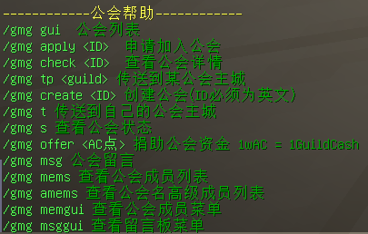
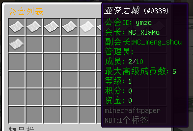
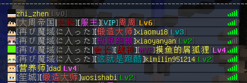
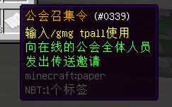

## 简介

基于Minecraft Spigot服务端开发的Bukkit插件









### 主要功能

- 通过控制台或玩家执行指令或行为监听执行操作
- 主要数据单元为Guilds
- 文件储存利用Google Gson
- 利用Bukkit的inventory类制作可视化菜单，如公会列表，成员列表，留言板等
- 利用Bukkit的监听器监听玩家行为来实现召集令的触发等功能和防止玩家拿走可视化菜单中的物品
- 调用Vault实现内部的经济操作
- 调用placehoAPI提供变量

### 依赖

#### Maven依赖：

`spigot` `VaultAPI`  `placeholderapi` `gson`

#### Bukkit插件依赖：

硬依赖：Vault

软依赖：PlaceholderAPI

### 使用方法

服务端要求 Spigot/Paper 1.12.2

将jar包放入服务端 /plugins 中开启后开启服务器

## 功能介绍

### 指令

#### 基本操作

普通玩家

/gmg

| 操作                      | 功能                                                         |
| ------------------------- | ------------------------------------------------------------ |
| list                      | 列出公会列表（遍历GuildManager.Guilds）                      |
| gui                       | 打开公会列表GUI                                              |
| memgui                    | 打开公会成员菜单                                             |
| msggui                    | 打开公会留言板菜单                                           |
| check                     | 查看某公会的具体数据                                         |
| tp                        | 传送到某公会的广场（调用指令warp）                           |
| t                         | 传送到自己的公会广场                                         |
| s                         | 查看公会状态                                                 |
| name/chairman/cash/points | 查看公会具体参数                                             |
| mems/amems                | 查看公会玩家/高级玩家列表                                    |
| offer                     | 为自己的公会捐献资金（检测必须为10000的倍数，对应1公会资金，调用vault模块操作玩家的货币） |
| create                    | 创建公会（需要500000，调用vault模块操作玩家的货币）          |
| msg                       | 留言板相关操作                                               |

###### 会长/副会长/管理员

/msg

| 操作              | 功能                                                         |
| ----------------- | ------------------------------------------------------------ |
| levelup           | 升级公会（若条件不满足会返回具体条件）                       |
| add/remove        | 增删成员                                                     |
| adda/removea      | 增删高级成员                                                 |
| setname           | 设置公会名（任意字符串，用于展示）                           |
| res create/remove | 公会领地创建/删除（直接命令调用Residence插件，需要提前选好点） |
| setwarp/delwarp   | 创建/删除公会地标（调用指令setwarp/delwarp）                 |
| buytpall          | 购买1份公会[召集令]()（5个）                                 |
| tpall             | 召集全公会玩家（消耗1个公会召集令）                          |
| clearmsg          | 清空留言板                                                   |
| posset/posremove  | 设置成员职位                                                 |
| setally           | 设置伙伴公会                                                 |


### PlaceholderAPI

| 权限结点                         | 功能           |
| -------------------------------- | -------------- |
| guildmanager_id                  | ID             |
| guildmanager_name                | 名称           |
| guildmanager_prefix              | 前缀           |
| guildmanager_chairman            | 会长           |
| guildmanager_cash                | 资金           |
| guildmanager_points              | 积分           |
| guildmanager_level               | 等级           |
| guildmanager_num_player          | 成员数         |
| guildmanager_max_player          | 最大成员数     |
| guildmanager_max_advanced_player | 最大高级成员数 |
| guildmanager_isadvanced          | 是否高级成员   |
| guildmanager_contribution        | 贡献度         |
| guildmanager_position            | 职位           |
| guildmanager_position_prefix     | 职位前缀       |
|                                  |                |
|                                  |                |
|                                  |                |
|                                  |                |


# 源码

源码具体介绍

只介绍了各个源码文件中的主要方法，具体操作细节请参考源码中的注释

## GuildManager

主类，用于接入Spigot的插件启动，关闭，注册以及插件的具体操作

###### 插件启动方法

1. 寻找前置vault和placeholapi（调用bukkit方法）
2. 实例化各对象
3. 完成bukkit的指令注册，监听器注册，序列化注册
4. 读取配置文件（调用bukkit方法）
5. 完成插件启动

###### 其他方法

- 关闭插件
- 重载：清空公会列表，重新读取配置文件数据
- 初始化Vault依赖
- 调用Bukkit使玩家发送指令操作的方法

## Guild

#### 成员变量

```java
private final String ID; //标记ID
private String GuildName; //公会名
private String ChairMan; //会长
private int Level; //等级
private int MaxPlayers; //最大成员数
private int AdvancedPlayers; //高级成员数
private int MaxAdvancedPlayers; //最大高级成员数
private int Points; //积分
private int RemoveMemLimitFlag; //成员删除限制flag
private boolean ResidenceFLag; //是否拥有领地
private HashMap<String , Member> Members= new HashMap<>(); //成员
private int Cash; //资金
```

#### 方法

- 成员变量的增删改查
- 实现了序列化
- 调用控制台发送指令赋予玩家领地权限
- 强制使用命令调用领地创建删除操作
- 保存配置文件

## Member

#### 成员变量

```java
private final String ID;     //标记玩家ID
private int contribution;    //贡献度
private boolean isAdvanced;  //是否为高级成员
```

#### 方法

- 成员变量的增删改查
- 实现了序列化

## Guilds

所有公会存储与本类的Hashmap中

- 公会的增删查的方法
- 根据玩家ID遍历得到其所在的公会的方法

## 指令处理器

以下三个类类似，均为对玩家的发送的指令进行监听

具体分析args数组然后执行相应的操作，并给玩家返回一些信息

例如

```java
if(args[0].equalsIgnoreCase("t")){
    if(!(sender instanceof Player)){
        sender.sendMessage(ErrorPrefix+"§c该指令只能由玩家发出");
        return true;
    }
    plugin.tpGuild(guild.getName(),sender.getName());
    sender.sendMessage(MsgPrefix+"§a传送成功");
    return true;
}
```

### GuildAdmin

管理员指令处理器

### GuildCommand

一般指令处理器

### GuildCommandS

公会会长/副会长/管理员指令处理器

## GuildItem

相关道具的数据和获取，使用方法

内置监听器，监听到玩家手持召集令右键则发动召集操作（向服务器在线玩家中是本公会的成员发起传送邀请）

```java
    @EventHandler
    public void onRightClick(PlayerInteractEvent event){
        if(event.getAction()== Action.RIGHT_CLICK_AIR){
            Player player = event.getPlayer();
            if(player.getInventory().getItemInMainHand().isSimilar(tpTicket)){
                String playerID = player.getName();
                Guild guild = guilds.getPlayersGuild(playerID);
                if(guild==null)
                    player.sendMessage(MsgPrefix+"你没有公会");
                else if (!guild.isLeader(playerID))
                    player.sendMessage(MsgPrefix+"只有会长/副会长/管理员可以使用");
                else {
                    player.sendMessage(MsgPrefix + "已发动召集令");
                    consumeItem(player.getInventory().getItemInMainHand());
                }
            }
        }
    }
```

目前只有召集令的构造与使用，未来可能加入其他道具

## JoinListener

监听玩家上线并作出相应操作

- 若玩家存在于某公会，提醒其目前在线的公会成员，并为其展示公会留言板内容
- 若玩家是高级成员，提醒其可以前往公会广场
- 若玩家是公会会长则发送全局公告

## GuildPAPI

实现papi变量的接入

供其他插件调用变量

## GuildGUI

这里并非使用了Java的GUI

利用Bukkit的Inventory和ItemStack类，把变量图像化显示

其中实现了公会列表，成员列表，留言板的GUI

1. 新建Inventory和ItemStack对象
2. 获取其ItemMeta
3. 把相关信息转化为ArrayList后导入ItemMeta
4. 返回到ItemStack
5. 把ItemStack导入到Inventory
6. 循环1-5遍历所有内容

内置监听器取消玩家的点击存取操作

## GuildRepository

利用Bukkit的Inventory，创建虚拟的背包作为公会公共仓库

内置监听器符合标准的玩家可以存取

使用org.bukkit.configuration.file.YamlConfiguration进行存储

